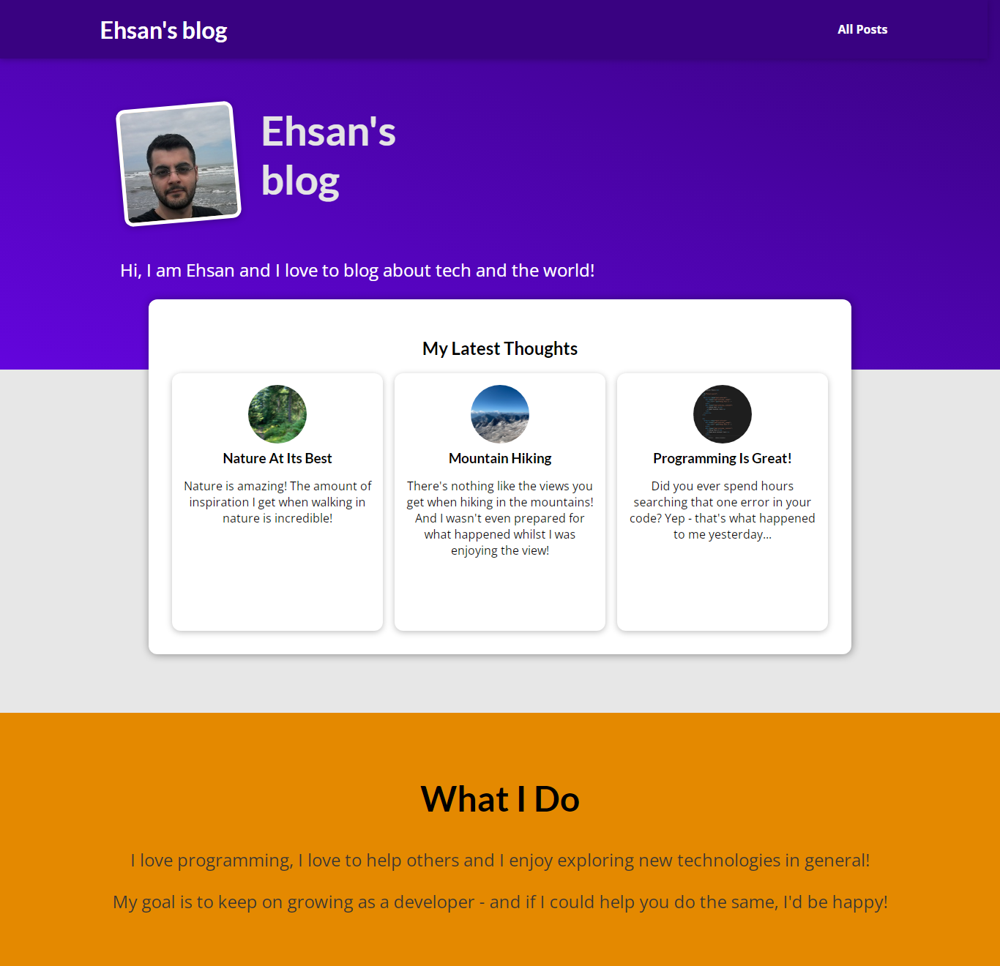
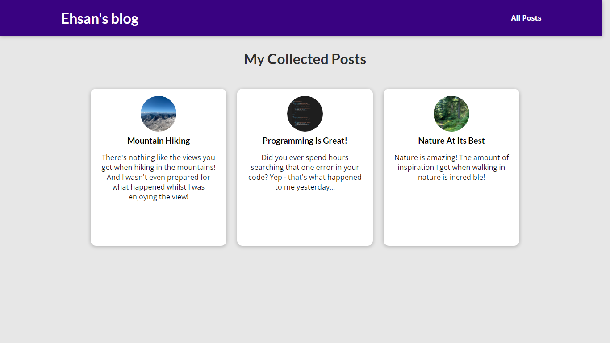
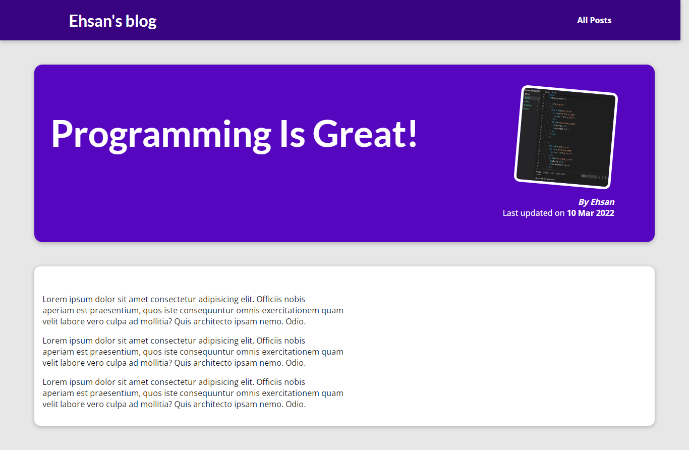

# Project-Building-a-Blog
Project Building a Blog 
<h3>The points considered in this project are:</h3>
1. Adding URLs & Views 
2. Adding First Templates 
3. Template Content & Static Files 
4. Adding Images as Static Files 
5. Adding the All Posts Page & Style 
6. Linking the Pages 
7. Adding the Single Post Page 
8. Adding Dummy Data to the Views File 
9. Special Template Features & Syntax 
10. Adding a Single Post Page 
11. Adding a 404 Page

<h2>Screenshots:</h2> 

